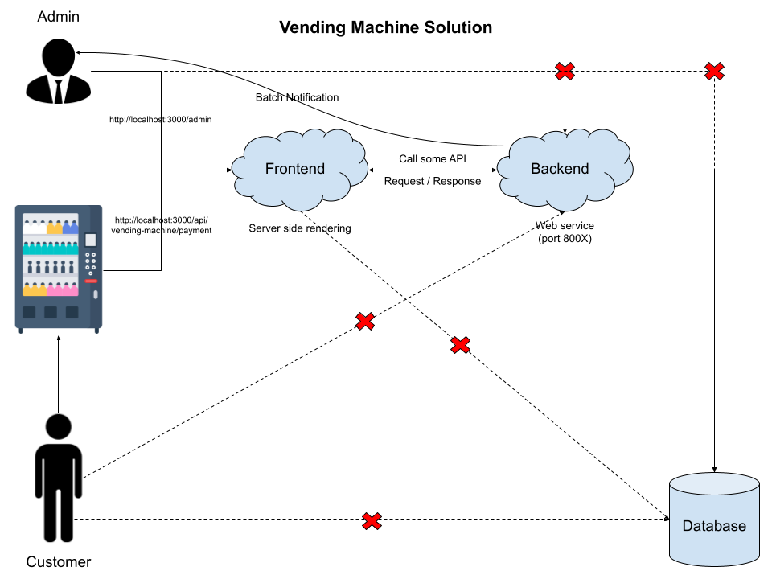
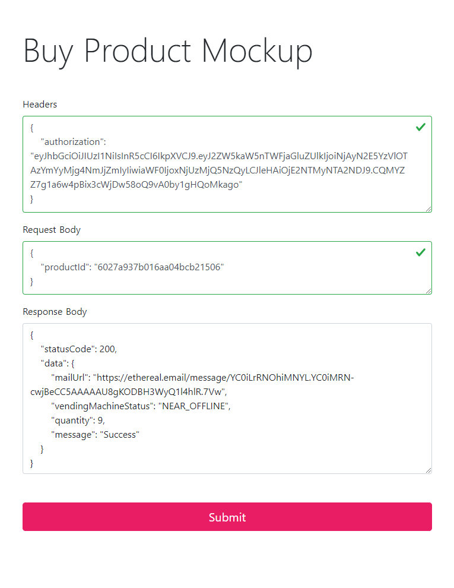
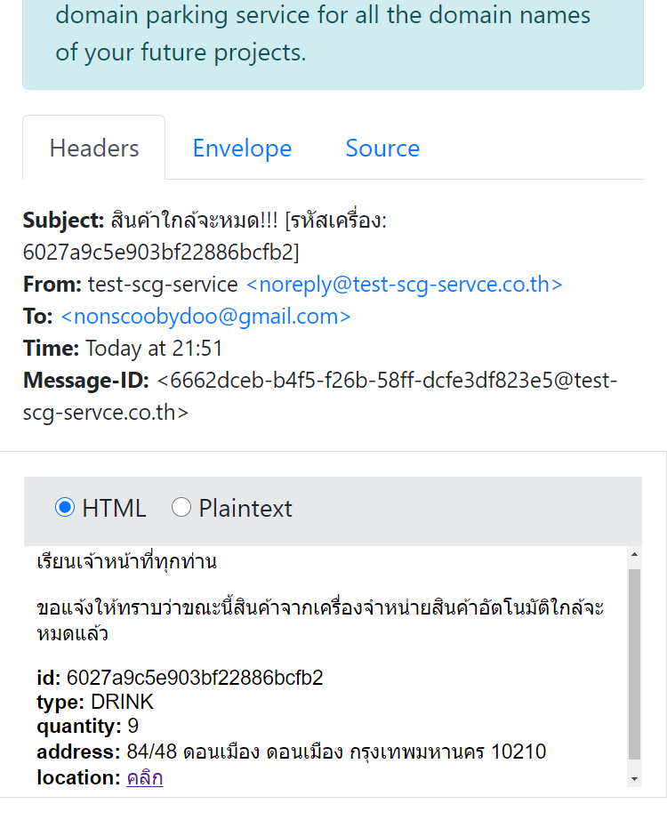
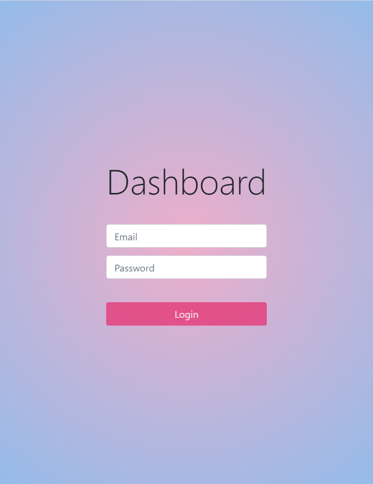
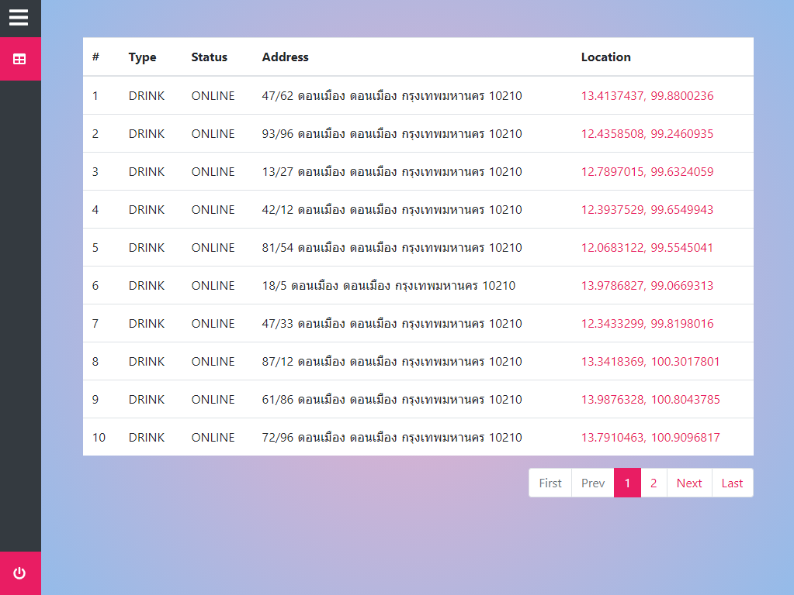

# test-scg-client (Nuxt.js)

Web application of vending machine solution. This project has repositories as below.

- [test-scg-client](https://github.com/einost/test-scg-client) (Nuxt.js)
- [test-scg-service](https://github.com/einost/test-scg-service) (Hapi.js)
- [test-scg-service-draft](https://github.com/einost/test-scg-service-draft) (Express.js)
- [test-scg-sdk](https://github.com/einost/test-scg-sdk) (Dependency of scg service)

### `Installation`

```bash
$ yarn
$ yarn dev

// localhost:3000
```

For detailed explanation on how things work, check out [Nuxt.js docs](https://nuxtjs.org).

### `Route`

- `/` Mockup template for simulate buy product.
- `/admin` Login template.
- `/admin/machine` Dashboard.

### Demo
[Video Guide](https://drive.google.com/file/d/15PQ2VAAv_T48Q-RGO96a09oxafqBhUKT/view?usp=sharing)

### Solution Design
[Vending Machine Solution](./static/docs/design/vending-machine-solution.pdf)

### Screenshots

<p align="center">
  
</p>
<p align="center">
  
</p>
<p align="center">
  
</p>
<p align="center">
  
</p>
<p align="center">
  
</p>
